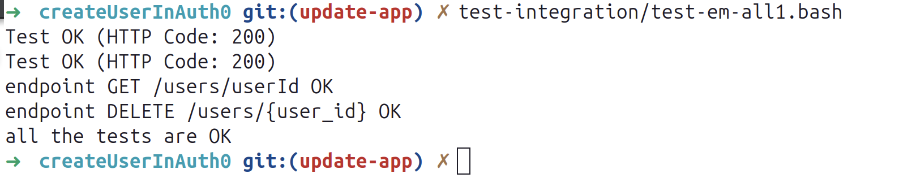

```bash
mvn spring-boot:run -Dspring-boot.run.profiles=dev
```

<h3>docker in local</h3>

(slow) To launch the Junit test in the docker container (this starts the postgresql service automatically):
```bash
docker compose run --rm --build test && docker image rm createuserinauth0-test
```

(fast) To launch the Junit test in local (postgresql service should be started beforehand):
```bash
mvn clean test -Dspring.profiles.active=dev
```

To generate and launch the docker image with the profile docker (stage test won't be executed):
```bash
rm libs/*
mvn -f ../feignCallsLib/pom.xml install -DskipTests
cp ../feignCallsLib/target/feignCallsLib-0.0.1-SNAPSHOT.jar libs/.
mvn -f ../restoCheckerDtos/pom.xml install -DskipTests
cp ../restoCheckerDtos/target/restoCheckerDtos-0.0.1-SNAPSHOT.jar libs/.
docker compose --env-file .env-local-dc up -d --build createuser
```

To launch the integration tests:
```bash
test-integration/test-em-all1.bash
```




For zsh users, here is the shortcut, stop all services, delete postgresql images/container, delete the volume, start postgresql:
```bash
dcstop; dcrm -f postgresql; docker volume rm createuserinauth0_postgres_data; dcupb postgresql;
```

```bash
cd /home/mordoc/DossierTravail/JavaProjets/Spring-Boot/Auth0CallToCreateUsers/createUserInAuth0
docker compose --env-file .env-local-dc ps -a
```
```bash
cd /home/mordoc/DossierTravail/JavaProjets/Spring-Boot/Auth0CallToCreateUsers/createUserInAuth0
docker compose --env-file .env-local-dc start postgresql
```
```bash
cd /home/mordoc/DossierTravail/JavaProjets/Spring-Boot/Auth0CallToCreateUsers/createUserInAuth0
docker compose --env-file .env-local-dc up -d --build createuser
docker compose --env-file .env-local-dc up -d createuser
```
```bash
cd /home/mordoc/DossierTravail/JavaProjets/Spring-Boot/Auth0CallToCreateUsers/createUserInAuth0
docker compose --env-file .env-local-dc logs -f createuser
```


